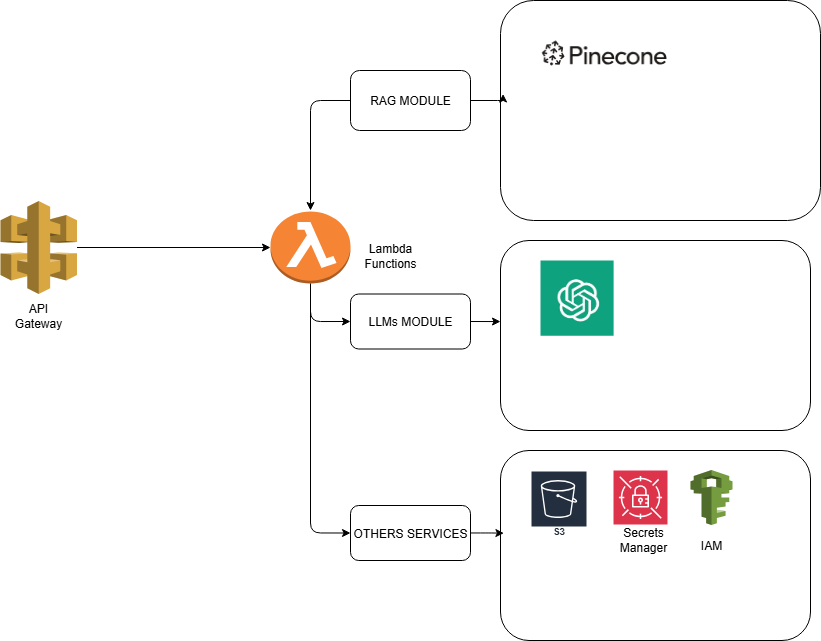

# terraform-aws-rag
This repository deploys a serverless API on AWS with Terraform, implementing the Retrieval-Augmented Generation (RAG) pattern with support for vector databases.

Infrastructure-as-Code portfolio project for deploying a serverless API on AWS using Terraform, implementing the Retrieval-Augmented Generation (RAG) pattern.

The RAG module is designed to support multiple vector database backends. At the beginning, the implementation is adapted for Pinecone, but additional modules (e.g., Chroma, FAISS, Weaviate) will be added to extend its use cases.

The architecture is modular and configurable: by adjusting variables, you can adapt the deployment to different vector databases and application needs. Each Terraform module provisions the required infrastructure and deploys the API services automatically, making the solution flexible, reusable, and extensible.

## Architecture

The solution is built as a **serverless API** on AWS, provisioned with **Terraform**.  
Incoming requests are routed through **API Gateway** to **Lambda functions**, which orchestrate three main modules:  

- **RAG Module** → Connects to a vector database service (initially Pinecone, later extendable to Chroma, FAISS, etc.).  
- **LLMs Module** → Calls language model providers (OpenAI initially, later extensible to Hugging Face Transformers, AWS Bedrock, etc.).  
- **Other Services** → Integrates with supporting AWS services such as **S3** (storage), **Secrets Manager** (API keys and configuration), and **IAM** (security and permissions).  

This modular design makes it easy to plug in different backends for retrievers and generators without changing the overall infrastructure.

## Future Work
- Add support for additional vector databases: Chroma, FAISS, Weaviate.  
- Extend LLM module with Hugging Face Transformers and AWS Bedrock.  
- Implement CI/CD pipelines for automated deployments.  
- Add monitoring and logging with CloudWatch.  
